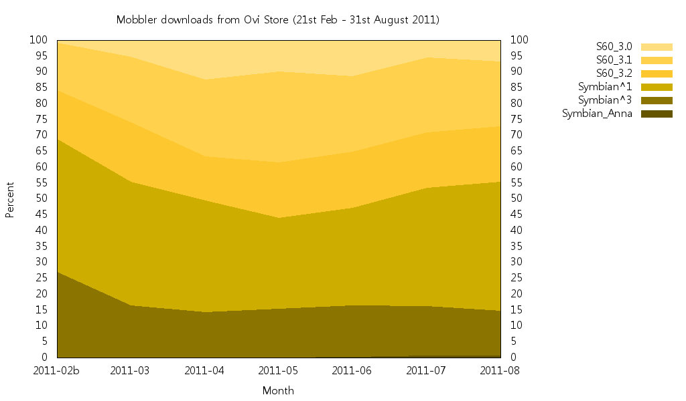
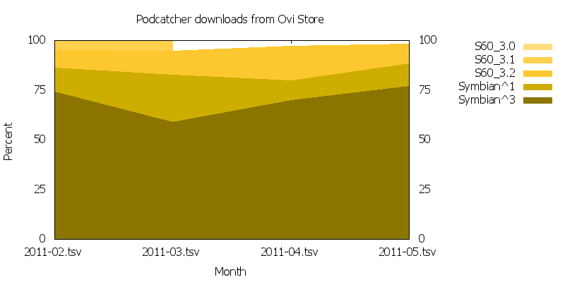
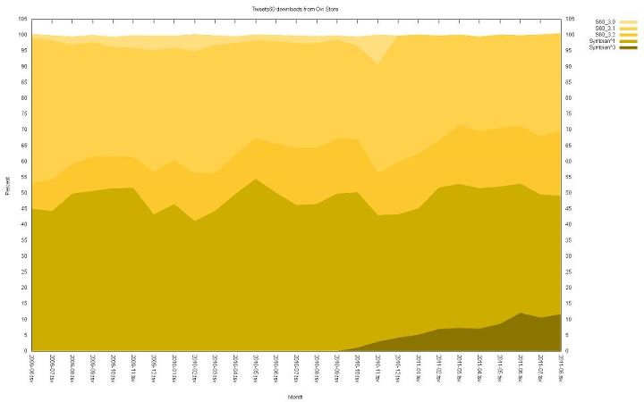
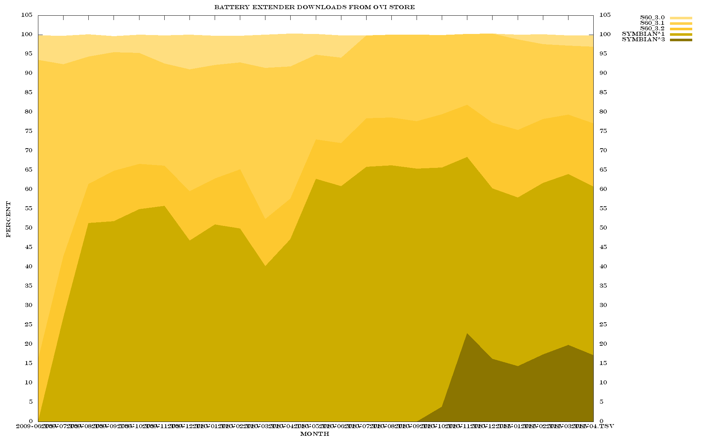

Here are some charts generated by [Ovid](../symbian-platform-share) showing the Symbian
platform share for some applications in Ovi Store.

First up,
[**Mobbler**](https://web.archive.org/web/20110930083815/http://code.google.com/p/mobbler/)
with 100,000 Ovi Store downloads (21st February - 31st Augst 2011):

The ratio of touch/non-touch decreased but then increased from 65/35 to 55/45. The
initial large 25% share of Symbian^3 is explained by the fact that the Ovi Store release
was the first to support S^3. This quickly decreased to the S^3 store average of 15%.

I've also updated the Ovid script to include Symbian Anna and Belle devices too, and you
can just see a tiny Anna sliver sneaking in along the bottom. Belle also has some Nokia
700 and 701 downloads, but it's too small to show up.

---

Next up,
[**Podcatcher**](https://web.archive.org/web/20110921195226/http://projects.developer.nokia.com/podcatcher)
(February - May 2011):

([source](https://web.archive.org/web/20110921195226/http://yfrog.com/h7enqep))

Podcatcher has a touch/non-touch ratio of around 8/2, and S^3 account for around 75% of
downloads. I expect there's so much Symbian^X because of the
[Nokia Podcasting](https://web.archive.org/web/20110921195226/http://europe.nokia.com/support/product-support/podcasting)
application either pre-installed or available as a sisx for older S60 3.x phones.

---

Now some charts with a nice long history: a pair of applications from
[Ravensoft](https://web.archive.org/web/20110921195226/http://www.ravensoft.co.uk/) that
have been in Ovi Store since June 2009.

Tweets60 with over 650,000 downloads (June 2009 - August 2011):

([source](https://web.archive.org/web/20110921195226/http://www.facebook.com/photo.php?pid=611731&l=6a4561a69f&id=134860453217403))

Tweets60 is better on non-touchscreen, so has a bias towards S60 3rd edition devices,
and the touch/non-touch ratio is about 1/1.

---

Finally, Ravensoft's
[**Battery Extender**](https://www.facebook.com/BatteryExtender/photos) with 2.5m
downloads (June 2009 - May 2011):

([source](https://www.flickr.com/photos/andynugent/5736310405/))

This is probably a fairly good representation as it appeals to all handsets. The
touch/non-touch ratio is around 6/4.

[Click here](../symbian-platform-share) to find out how to use Ovid; if any other
developers/publishers have run the scripts, leave a comment! Thanks to
[Andy Nugent](https://web.archive.org/web/20180306200409/https://twitter.com/nugent)
from
[Ravensoft](https://web.archive.org/web/20110921195226/http://www.developer.nokia.com/Community/Blogs/blog/hugo-van-kemenades-forum-nokia-blog/2011/09/08/symbian-platform-share-in-the-ovi-store-ii#:~:text=Nugent%C2%A0from-,Ravensoft,-and%C2%A0Sebastian)
and
[Sebastian Brannstrom](https://web.archive.org/web/20110921195226/http://twitter.com/teknolog)
for sharing their charts.

---

Originally posted on
[Hugo van Kemenade's Forum Nokia Blog](https://web.archive.org/web/20110921195226/http://www.developer.nokia.com/Community/Blogs/blog/hugo-van-kemenades-forum-nokia-blog/2011/09/08/symbian-platform-share-in-the-ovi-store-ii).
