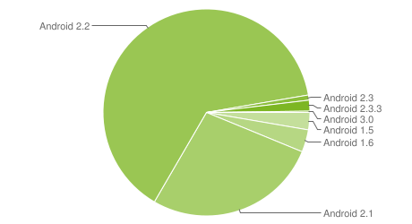
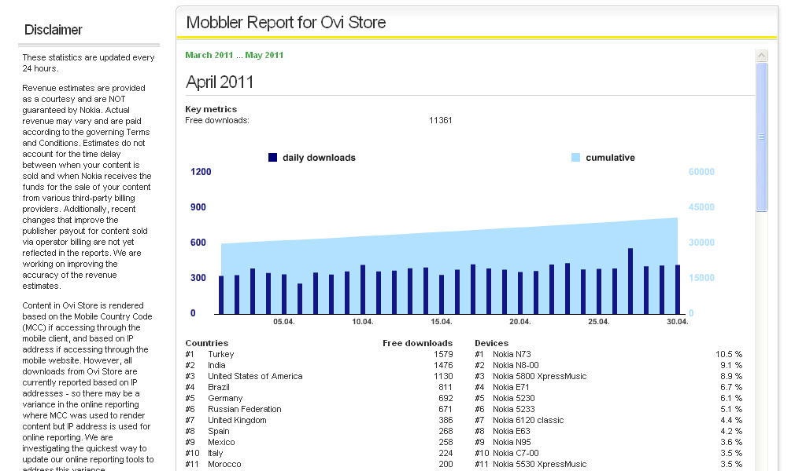
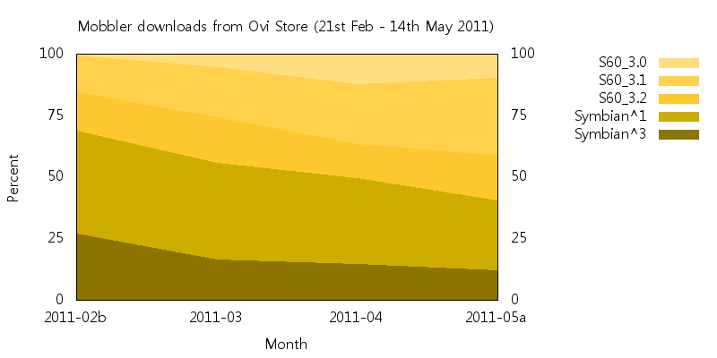

Android provides this very useful chart\* for developers, making it very clear which
platforms are in common usage, so developers can accurately target different platforms.

[](https://web.archive.org/web/20110423230549/http://developer.android.com/resources/dashboard/platform-versions.html)

Unfortunately Nokia/Ovi Store don't provide this kind of data so it's left to guesswork.
For example, last July (and before Symbian^3 came out), All About Symbian claimed the
split of S60 5th edition to 3rd edition application sales was
[roughly 10 / 1](https://allaboutsymbian.com/news/item/11840_Why_do_Symbian_developers_take.php),
"collating info from a number of sources", though they won't share these sources.

Ovi Store provides publishers with a monthly report of how many downloads have been
made, a rank of the countries, and also a rank of which phones that have downloaded your
application alongside a percentage. They don't break it down into a share of the
different platforms: S60 3rd edition, S60 5th edition/Symbian^1, Symbian^3.



So I've knocked up a Perl script to take the monthly reports and divvy out a platform
share and plot it. Here's a graph of Mobbler downloads by month.



Mobbler was previously in the Ovi Store through the
[Symbian Foundation's Horizon programme](http://news.bbc.co.uk/2/hi/technology/8152443.stm),
but since the closure of the Foundation we don't have access to the old data. The newest
Mobbler 2.x has been back in the store since February through our own account: 48,906
downloads from
[Ovi Store](https://web.archive.org/web/20120504212053/http://store.ovi.com/content/75692)
(and another 16,126 from
[Google Code](https://web.archive.org/web/20120406133209/http://code.google.com/p/mobbler/downloads/list)).

It's strange to see the numbers going the "wrong" way. Why is this?

Well, Nokia recently said in a
[press release](https://web.archive.org/web/20120504212053/http://press.nokia.com/2011/04/12/nokias-ovi-store-hits-5-million-downloads-per-day-as-users-enjoy-new-symbian-devices-and-apps/)
Symbian^3 devices "account for about 15 percent of the daily downloads". And this very
closely matches Mobbler's S^3 numbers for March (14.6%), April (16.3%) and half of May
(14.4%) . It was almost double that in February (27.1%), presumably a rush from S^3
owners due to it being the first Mobbler release that supported their phones.

But why are the older S60 3rd edition platforms growing in share? I've no idea.

Would you like to create a chart like this for your Ovi Store application? Here's how,
and I'd really like to see charts from other applications that have been in Ovi Store
for longer.

**Step 1.** Grab the Ovid scripts from
[Forum Nokia Projects](https://web.archive.org/web/20120504212053/http://projects.forum.nokia.com/ovid/).

**Step 2.** The boring manual step. Paste the tab seperated devices list from the Ovi
Publish report into .tsv files, one per month. For example 2011-03.tsv:

```
#1     Nokia N8-00      11.2 %
#2     Nokia 5800 XpressMusic      10.2 %
<snip>
#68     Nokia N93      0.0 %
```

**Step 3.** To generate a single report, call

```sh
ovid.pl 2011-03.tsv
```

This outputs to standard output, for example:

```
#1      11.2%   Symbian^3       Nokia N8-00
#2      10.2%   Symbian^1       Nokia 5800 XpressMusic
<snip>
#68     0.0%    S60 3.0         Nokia N93
=============================
4 Symbian^3 models:     16.3%
12 Symbian^1 models:    39%
51 S60 3rd edition:     44%
-----------------------------
25 S60 3.2 models:      18.5%
13 S60 3.1 models:      20.6%
13 S60 3.0 models:      4.9%
-----------------------------
1 unknown models:       0.3%
=============================
68 total models:        99.6%
=============================

Ignoring the unknown:
=============================
4 Symbian^3 models:     16.3%
12 Symbian^1 models:    39.1%
51 S60 3rd ed. models:  44%
-----------------------------
25 S60 3.2 models:      18.6%
13 S60 3.1 models:      20.7%
13 S60 3.0 models:      4.9%
=============================
67 total models:        99.6%
=============================
```

**Step 4.** To generate a chart for several months, download
[gnuplot](https://web.archive.org/web/20120504212053/http://www.gnuplot.info/download.html)
and stick it in your PATH. (Tested with gnuplot version 4.4.0.)

**Step 5.** Edit ovid.plt to set a title for your chart.

**Step 6**. Run ovid.bat. This runs ovid.pl on all the .tsv files. There's usually at
least one unknown model: "Unresolved". If you get any others, the missing models need
adding to the lists at the top of ovid.pl. Please let me know and I'll update the script
as well.

If you use this, please post links to your charts too!

---

<small>\* Portions of this page are reproduced from work created and shared by the
[Android Open Source Project](https://web.archive.org/web/20120504212053/http://code.google.com/policies.html)
and used according to terms described in the
[Creative Commons 2.5 Attribution License](https://creativecommons.org/licenses/by/2.5/).</small>

Originally posted on
[Hugo van Kemenade's Forum Nokia Blog](https://web.archive.org/web/20110518012939/http://blogs.forum.nokia.com/blog/hugo-van-kemenades-forum-nokia-blog/2011/04/26/symbian-platform-share).
