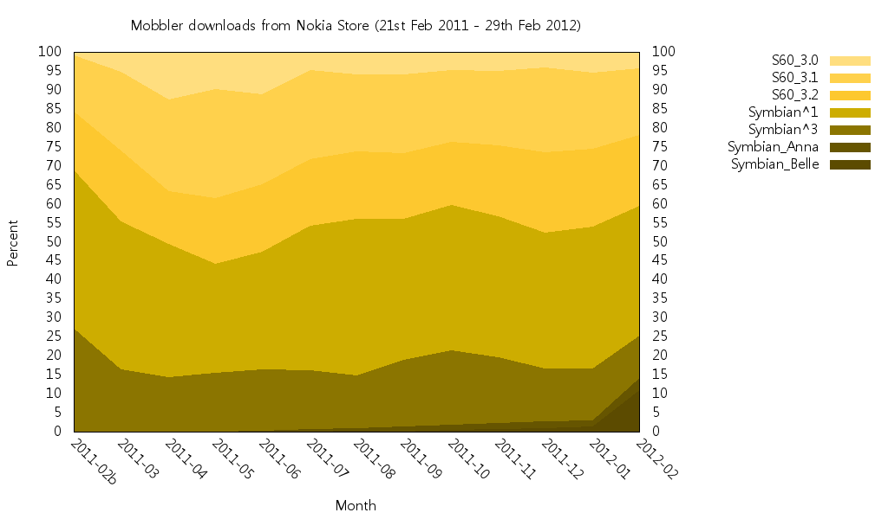

[Mobbler](https://web.archive.org/web/20120523061840/http://code.google.com/p/mobbler/)
has now been in the Nokia Store for a year (not counting the previous stint under
Symbian Horizon), so here's an updated chart generated using
[Ovid](../../2011/symbian-platform-share).

With a year's worth of download data, it's interesting to see S60 3rd Edition is still
going strong. There's a recent peak in Symbian Belle after I noticed distribution wasn't
set for all Belle devices in the Nokia Store settings.

See [here](../../2011/symbian-platform-share-ii) for some older charts for other
applications. Let me know if you create charts for your applications.

---

Originally posted on
[Hugo van Kemenade's Forum Nokia Blog](https://web.archive.org/web/20120523061840/http://www.developer.nokia.com/Community/Blogs/blog/hugo-van-kemenades-forum-nokia-blog/2012/03/12/symbian-platform-share-in-the-nokia-store-iii).
