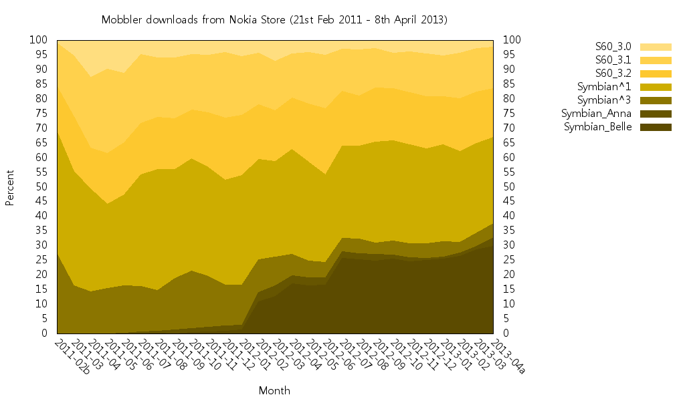

[Mobbler](https://web.archive.org/web/20130429152255/http://www.developer.nokia.com/Community/Blogs/code.google.com/p/mobbler/),
the open-source
[Last.fm](https://web.archive.org/web/20130429111842/http://www.last.fm/group/Mobbler+Users)
radio player and scrobbler for Symbian smartphones is five years old today!

To commemorate, here's an updated (generated by
[Ovid](../../2011/symbian-platform-share)) chart showing the share of its 225,098
downloads in the
[Nokia Store](https://web.archive.org/web/20130429152255/http://store.ovi.com/content/75692).

[](https://www.flickr.com/photos/hugovk/8630568841/)

With a second year's worth of download data, it's interesting to see S60 3rd Edition is
still going strong.

Figures for the last full month (March 2013):

```
==============================
11 Symbian Belle models: 28.7%
3 Symbian Anna models:    1.1%
5 Symbian^3 models:       4.6%
12 Symbian^1 models:     30.5%
38 S60 3rd ed. models:     36%
------------------------------
22 S60 3.2 models:       17.5%
12 S60 3.1 models:       14.9%
4 S60 3.0 models:         3.1%
==============================
```

See [here](../../2011/symbian-platform-share-ii) for some older charts for other
applications. Let me know if you create charts for your applications.

---

Originally posted on
[Hugo van Kemenade's Forum Nokia Blog](https://web.archive.org/web/20130429152255/https://www.developer.nokia.com/Community/Blogs/blog/hugo-van-kemenades-forum-nokia-blog/2013/04/08/symbian-platform-share-in-the-ovi-store-iv).
