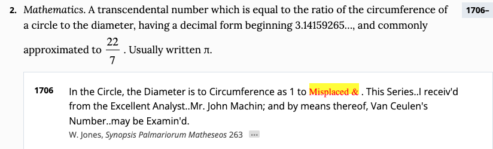
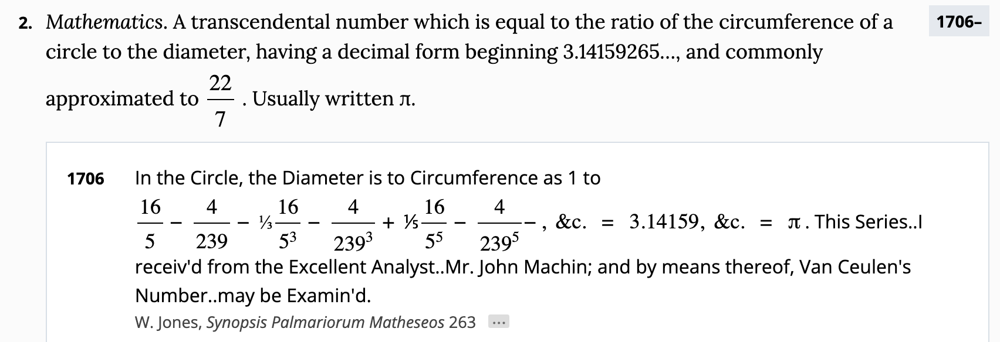

Yes, but not the
[`dict`](https://docs.python.org/3/library/stdtypes.html#mapping-types-dict) kind of
dictionary.

When working on CPython, we often find obscure bugs elsewhere, in compilers, operating
systems and elsewhere:

- [Rust/LLVM](https://emmatyping.dev/finding-a-miscompilation-in-rustllvm.html),
  [clang-19](https://github.com/llvm/llvm-project/issues/106846),
  [clang 21](https://github.com/llvm/llvm-project/issues/179695) and
  [BOLT](https://github.com/llvm/llvm-project/pull/120267)
- [GCC 13](https://github.com/python/cpython/issues/129987#issuecomment-2761279236),
  [GCC 15](https://gcc.gnu.org/bugzilla/show_bug.cgi?id=118430),
  [glibc](https://github.com/python/cpython/issues/127000),
  [readline](https://github.com/python/cpython/issues/122431) and
  [curses](https://github.com/python/cpython/issues/120378)
- [musl fma](https://github.com/python/cpython/issues/131032)

Since Python 3.8, the release notes have a section called "And now for something
completely different". These have included Monty Python sketches, astrophysics facts and
poetry.

For Python 3.14, I'm doing all things
[_π_](https://discuss.python.org/t/python-3-14-0-final-is-here/104210?u=hugovk#p-273519-and-now-for-something-completely-different-9),
[pie](https://discuss.python.org/t/python-3-14-0-alpha-3/74542?u=hugovk#p-214989-and-now-for-something-completely-different-3)
and
[[mag]pie](https://discuss.python.org/t/python-3-14-0rc2-and-3-13-7-are-go/102403?u=hugovk#p-267064-and-now-for-something-completely-different-13)
([more here](../../2025/and-now/)). As part of the research for this important task, I
looked up _pi_ in the
[_Oxford English Dictionary_](https://www.oed.com/dictionary/pi_n1?tab=factsheet&tl=true#30481837).

As we all recall from the
[Python 3.14.0b1 release notes](https://discuss.python.org/t/python-3-14-0-beta-1-is-here/91117#p-246172-and-now-for-something-completely-different-8),
William Jones was the first person to use the _π_ symbol to denote the circle's
circumference to its diameter in his
[_Synopsis Palmariorum Matheseos_](https://archive.org/details/SynopsisPalmariorumMatheseosOrANewIntroductionToTheMathematics/page/n283/mode/1up?view=theater)
(1706):

However, the _OED_'s first citation had a markup bug:

I duly reported this to the _OED_ in July 2024; and by the next time I looked it up, in
June 2025, it was fixed!

Hooray!

---

<small>Header photo: Part of the definition for "get" in the _OED_'s 1901 forerunner, _A
New English Dictionary on Historical Principles_
(<a target="_blank" rel="noopener noreferrer" href="https://creativecommons.org/licenses/by-nc-sa/2.0/">CC
BY-NC-SA 2.0</a>
[Hugo van Kemenade](https://www.flickr.com/photos/hugovk/8192259573)).</small>
