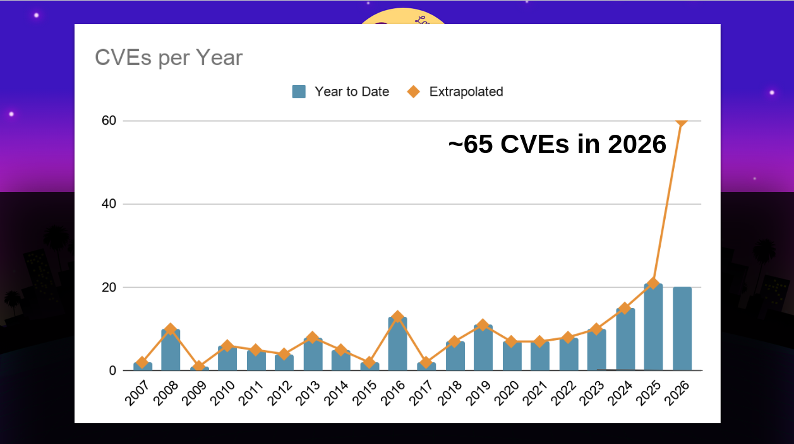
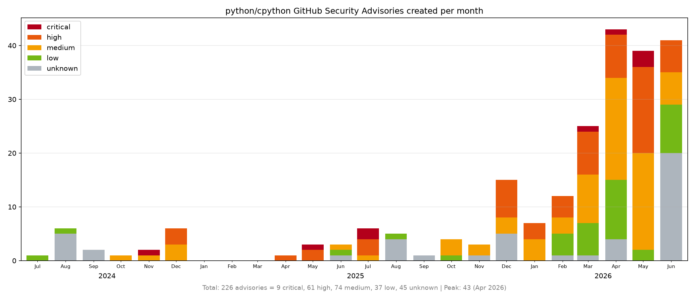
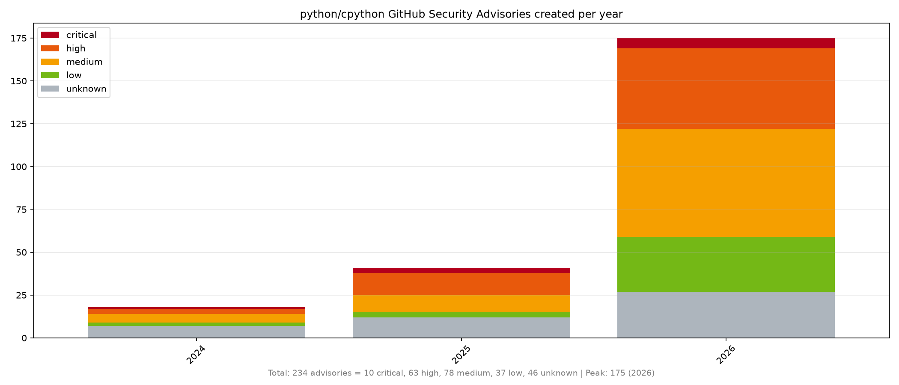
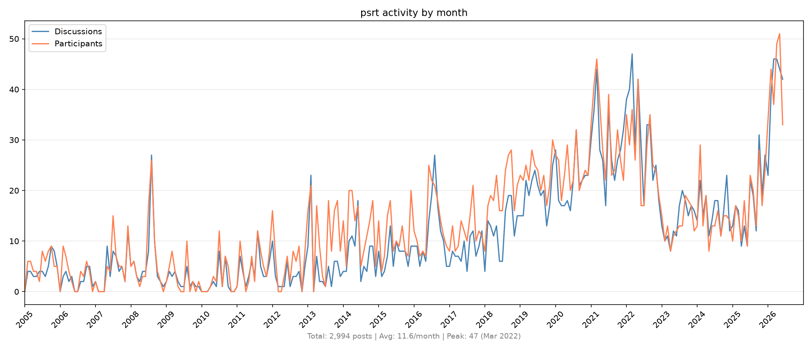

Like many other projects, CPython is experiencing a huge increase in security reports.

## CVEs per year

Last month, PSF Security Developer-in-Residence [Seth Larson](https://sethmlarson.dev/)
posted a chart of
[CVEs per year](https://mastodon.social/@sethmlarson/116680835974208152), showing a
large increase in 2026:

But this only represents the _output_ of security work, and doesn't show all the work
dealing with incoming reports. Many are closed and dealt with as non-security bug
reports instead; many are closed as neither security nor bug reports.

Let's reveal some of this unseen work by the
[Python Security Response Team](https://devguide.python.org/security/psrt/) (PSRT).

## GHSAs by month

Here are the number of incoming GitHub Security Advisories (GHSA) reports created since
July 2024:

## GHSAs by year

Here is the same thing by year, and remembering we're only _halfway through 2026_:

## Email reports by month

We've only fairly recently been
[encouraging new reports](https://devguide.python.org/security/policy/) be made via
GHSA. Before this, they were usually made by email. The next chart is the number of
email discussions (or threads) and participants by month:

## Thanks

Big thanks to Seth for all his work as Security Developer-in-Residence: helping shepherd
all these reports, developing a
[security policy](https://devguide.python.org/security/policy/) to improve the quality
of incoming reports and help us assess them, and defining PSRT membership and
responsibilities via [PEP 811](https://peps.python.org/pep-0811/) to build an active
team. All this would be much harder without his guidance! And thanks to
[Alpha-Omega](https://alpha-omega.dev/) for sponsoring his position at the PSF.
